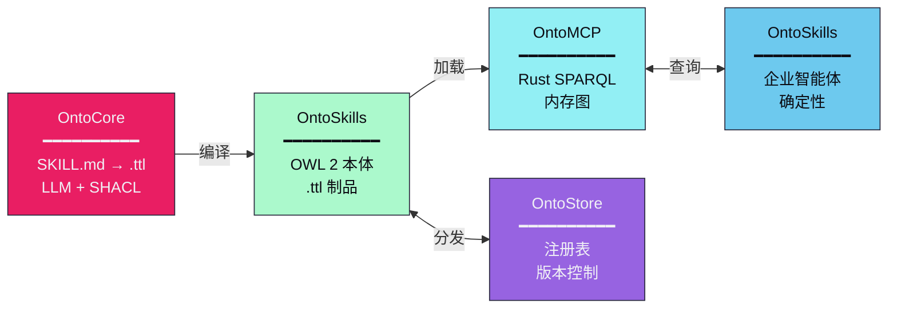
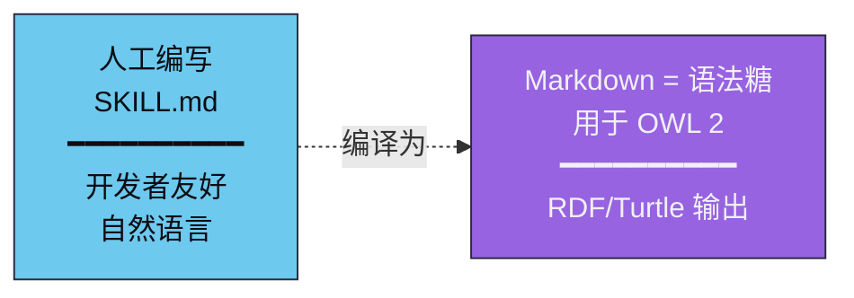
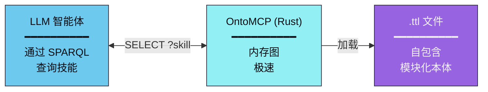
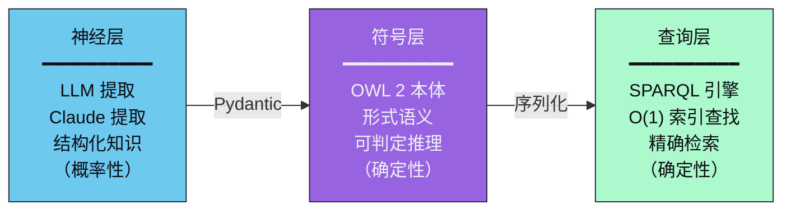
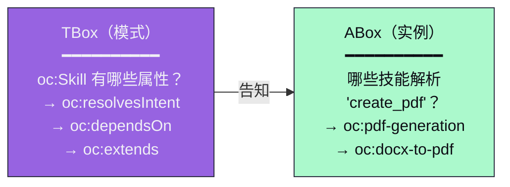

# OntoSkills 设计理念

<p align="right">
  <a href="PHILOSOPHY.md">🇬🇧 English</a> • <b>🇨🇳 中文</b>
</p>

## 0. 神经符号 AI 智能体平台

OntoSkills 不仅仅是一个编译器——它是一个用于构建确定性、企业级 AI 智能体的**完整神经符号平台**。生态系统由五个分层组件组成：



### 愿景

**OntoSkills** 的灵感来自 OpenClaw、Claude Code 和 Cursor——但专注于**企业级**，强调：

- **确定性**：OWL 2 描述逻辑保证可判定的推理
- **速度**：基于 Rust 的运行时（OntoMCP）实现极速 SPARQL 查询
- **可靠性**：SHACL 验证确保本体一致性
- **模块化**：即插即用的技能本体

核心洞察：**技能是编译后的制品，而非解释执行的文档。**

---

## 1. 生命周期：源代码 vs 制品

OntoCore 为技能实现了**编译时范式**，将人工编写与机器执行分离：

### 设计时（源代码）



为什么用 Markdown？因为手工编写原始 Turtle 是糟糕的开发体验。

OntoCore 将**所有内容**提取到 TTL 中：
- 意图（`oc:resolvesIntent`）
- 状态转换（`oc:requiresState`、`oc:yieldsState`、`oc:handlesFailure`）
- **执行负载**（`oc:hasPayload`，包含 `oc:executor` + `oc:code` 或 `oc:executionPath`）
- 依赖和关系（`oc:dependsOn`、`oc:extends`、`oc:contradicts`）

### 运行时（制品）



**SKILL.md 文件在智能体的上下文中不存在。** .ttl 文件是自包含、模块化、可插拔的本体。所有逻辑都存在于 RDF 中。

**编译后的 TTL 是可执行制品。Markdown 只是被编译掉的源代码。**

这种分离实现了：
- **人工友好的编写**（开发时的 Markdown）
- **机器最优的执行**（运行时的 OWL 2）
- **模块化部署**（无需触碰源代码即可插拔技能本体）

---

## 2. 核心问题

大语言模型强大但**非确定性**。相同的提示词可能在不同运行中产生不同输出。当智能体必须导航数十个技能时，它面临：

### 上下文和规模

- **上下文腐化**：加载 50+ 个 SKILL.md 文件消耗上下文窗口
- **幻觉风险**：分散在文件中的信息容易被误记
- **无可验证的结构**："技能 A 是否依赖技能 B？"需要阅读两个文件

### 小模型问题

这是问题变得**关键**的地方：较小的模型（7B-14B 参数）越来越多地用于：

- **边缘计算**：无需云依赖的设备端推理
- **成本降低**：$0.001/1K tokens vs 前沿模型的 $0.015/1K tokens
- **隐私**：敏感数据从不离开本地机器
- **延迟**：实时应用的亚 100ms 响应时间

**但小模型无法加载 50 个技能文件。** 考虑：

| 模型 | 上下文窗口 | 实际容量 |
|-------|---------------|-------------------|
| Claude Opus 4 | 200K tokens | ~100 个技能文件 |
| Claude Sonnet | 200K tokens | ~100 个技能文件 |
| Llama 3.1 8B | 128K tokens | ~60 个技能文件 |
| Mistral 7B | 32K tokens | ~15 个技能文件 |
| Phi-3 Mini | 4K tokens | ~2 个技能文件 |

7B 模型在上下文耗尽前几乎无法加载**单个技能生态系统**。即使上下文适合：

- **理解力下降**：小模型难以从非结构化文本中提取结构化关系
- **推理中断**："哪些技能可以处理状态 X？"需要多文件推理，小模型无法完成
- **一致性失败**：关于技能依赖的相同查询可能在不同运行中返回不同答案

### 成本螺旋

对于大规模运行智能体的企业，token 消耗直接影响底线：

| 场景 | Tokens | 每 100 万查询成本 (Opus 4.6) | 每 100 万查询成本 (Sonnet 4.6) |
|----------|--------|-------------------------------|--------------------------------|
| 加载全部 50 个技能 | ~300K | $2,500 | $1,500 |
| SPARQL 查询本体 | ~1.5K | $17.50 | $10.50 |

*定价：Opus 4.6（$5/MTok 输入，$25/MTok 输出），Sonnet 4.6（$3/MTok 输入，$15/MTok 输出）*

本体方法将 Sonnet 的成本降低约 **150 倍**。

### 重试问题

非确定性推理产生了一个隐藏的成本乘数：**愚蠢的重试**。

当 LLM 智能体解释技能元数据时，它会犯不可预测的错误：

**浪费性重试的例子：**
- **错误的工具调用**：智能体调用 `list_skills` 而不是 `find_skills_by_intent`
- **散射方法**：在找到一个有效的技能前尝试 3-4 个不同的技能
- **幻觉能力**："这个技能可能可以处理图像"——实际上不能
- **理解循环**：反复重读技能描述试图"理解它"
- **上下文溢出**：加载整个技能文件只为回答"这需要什么？"

每次重试都消耗完整的上下文窗口。对于 50+ 个技能，这会迅速累积。

**使用确定性 SPARQL：**
- 相同输入 → 相同结果（零解释差异）
- 技能选择是**精确的**，而非概率性的
- **没有"思考"开销**——查询直接返回答案
- **没有幻觉**——本体是唯一的事实来源
- **可预测的成本**——你确切知道每个查询消耗多少 token

**确定性不仅仅关乎正确性——它关乎消除浪费。**

### 一致性差距

即使是大模型也遭受**不一致的技能解释**：

- **模糊的语言**："此技能需要身份验证"——那是前置条件还是功能？
- **隐式关系**：技能 A 提到"使用技能 B 进行验证"——那是依赖？扩展？
- **分散的元数据**：意图字符串、状态需求和执行提示隐藏在散文中

没有形式语义，每个关于技能的 LLM 查询都是对**解释的赌博**。

---

这就是 LLM 时代的**知识检索问题**——OntoSkills 通过使技能**可查询而非可读**来解决它。

---

## 3. 本体解决方案

OntoSkills 应用**描述逻辑（DL）**——具体是 OWL 2 DL 底层的 **$\mathcal{SROIQ}^{(D)}$** 片段——将非结构化技能定义转换为**形式化的、可查询的知识图谱**。

### 为什么是 $\mathcal{SROIQ}^{(D)}$？

每个字母代表一种能力，解决技能建模中的特定问题：

| 特性 | 能力 | OntoSkills 示例 |
|---------|------------|------------------|
| **$\mathcal{S}$** | 传递属性 | `A extends B extends C` → 自动推导 A extends C |
| **$\mathcal{R}$** | 复杂角色包含 | `dependsOn` 和 `contradicts` 互斥 |
| **$\mathcal{O}$** | 个体（枚举类） | 定义 `EntryPoints = {create, import, init}` |
| **$\mathcal{I}$** | 逆属性 | `A dependsOn B` ↔ `B enables A`（自动推导） |
| **$\mathcal{Q}$** | 基数限制 | `ExecutableSkill` 恰好有 1 个 `hasPayload` |
| **$\mathcal{D}$** | 数据类型 | 字符串、整数、布尔值用于字面量 |

**可判定性**：OWL 2 DL 是可判定的——推理算法在有限时间内以正确答案终止。这与 LLM 推理的开放式性质形成对比。

---

## 4. 神经符号架构

OntoSkills 是**神经符号的**：它结合了神经和符号 AI 范式。



- **神经**：Claude 从自然语言中提取结构化知识（OntoCore）
- **符号**：OWL 2 本体以形式语义存储知识（OntoSkills）
- **查询**：SPARQL 提供精确、索引化的检索（OntoMCP）

神经层处理歧义和解释。符号层确保一致性和可验证性。

---

## 5. 智能民主化

一个关键抱负：**使较小的模型能够对大型技能生态系统进行推理**。

考虑一个有 100 个技能的智能体：
- **没有本体**：必须阅读 100 个 SKILL.md 文件（~500KB 文本）来理解能力
- **有本体**：在毫秒内查询 `SELECT ?skill WHERE { ?skill oc:resolvesIntent ?intent }`

这对以下场景特别有价值：
- **边缘部署**：本地硬件上的较小模型
- **成本降低**：每次查询处理更少的 token
- **可靠性**：确定性答案，没有关于技能关系的幻觉

### 模式暴露

在查询之前，LLM 需要知道：**"我可以问什么？"**

OntoSkills 分别暴露 **TBox**（术语盒）——类和属性的模式——与个体技能的 **ABox**（断言盒）。



这种两阶段查询防止"盲目"提问并提高精度。

---

## 6. 性能特征

| 操作 | 文本文件 | OWL 本体 |
|-----------|------------|--------------|
| 按意图查找技能 | O(n) 扫描所有文件 | O(1) 索引 SPARQL |
| 检查依赖 | 解析每个文件 | 跟随 `oc:dependsOn` 边 |
| 检测冲突 | 比较所有对 | `oc:contradicts` 查找 |
| 传递闭包 | 递归扫描 | OWL 推理（可选） |

对于 100 个平均 5KB 的技能：
- **文本扫描**：~500KB 需要读取
- **SPARQL 查询**：~1KB 索引查找

差距随规模扩大。

---

## 7. 模式优先查询

传统技能系统要求 LLM "猜测"存在什么信息。OntoSkills 反转这一点：

1. **首先**：查询 TBox 以了解可用的类和属性
2. **然后**：使用已知谓词构建精确的 ABox 查询

TBox 查询示例：

```sparql
SELECT ?property ?range WHERE {
  ?property rdfs:domain oc:Skill .
  ?property rdfs:range ?range .
}
```

返回：`oc:resolvesIntent → xsd:string`、`oc:dependsOn → oc:Skill` 等。

这实现了**知情查询**——LLM 在提问前就知道本体的结构。

---

## 8. 企业焦点

OntoSkills 为**生产环境企业**设计：

### 确定性优于灵活性

当其他智能体优化灵活性时，OntoSkills 优化**可预测、可重现的行为**：

- 相同输入 → 相同技能选择（通过 SPARQL，而非 LLM 判断）
- 相同依赖 → 相同执行顺序（通过 `oc:dependsOn` 边）
- 相同状态 → 相同转换（通过 `oc:requiresState` / `oc:yieldsState`）

### 安全优先

OntoCore 实现**纵深防御**：
- 对已知攻击向量的正则模式匹配
- 对模糊内容的 LLM 审查
- SHACL 验证防止畸形本体
- 不执行未经验证的负载

### 审计追踪

每个编译后的技能携带：
- `oc:generatedBy`——哪个 LLM 模型提取了它
- `oc:hash`——用于完整性验证的内容哈希
- `oc:provenance`——源文件引用

---

## 9. 研究基础

OntoSkills 建立在知识表示、逻辑推理和现代 AI 数十年的研究之上：

**描述逻辑与推理**
* Baader, F., Calvanese, D., McGuinness, D., Nardi, D., & Patel-Schneider, P. (2003). *The Description Logic Handbook*. Cambridge University Press.
* Horrocks, I., Kutz, O., & Sattler, U. (2006). "The Even More Irresistible SROIQ". *Proceedings of KR-2006*.（OWL 2 的数学基础）。

**本体与验证（W3C）**
* W3C OWL 2 Web Ontology Language (2009). https://www.w3.org/TR/owl2-overview/
* Cuenca Grau, B., Horrocks, I., Motik, B., et al. (2008). "OWL 2: The next step for OWL". *Journal of Web Semantics*.
* Knublauch, H., & Kontokostas, D. (2017). "Shapes Constraint Language (SHACL)". *W3C Recommendation*.

**知识表示**
* Brachman, R., Levesque, H. (2004). *Knowledge Representation and Reasoning*. Morgan Kaufmann.
* Sowa, J. (2000). *Knowledge Representation: Logical, Philosophical, and Computational Foundations*. Brooks/Cole.

**神经符号 AI 与语义网**
* d'Avila Garcez, A., Lamb, L. (2020). "Neurosymbolic AI: The 3rd Wave". *arXiv:2012.05876*.
* Pan, S., et al. (2024). "Unifying Large Language Models and Knowledge Graphs: A Roadmap". *IEEE TKDE*.
* Heath, T., Bizer, C. (2011). "Linked Data: Evolving the Web into a Global Data Space". *Synthesis Lectures on the Semantic Web*.
* SPARQL 1.1 Query Language (2013). https://www.w3.org/TR/sparql11-query/

*OntoSkills 是桥梁：神经灵活性用于提取，符号严谨性用于存储，精确查询用于检索。*
