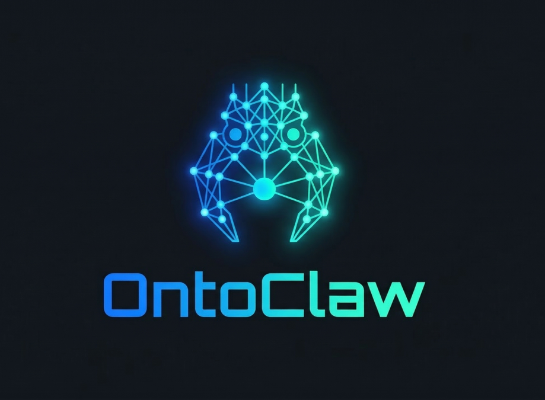

<p align="center">
  
</p>

<h1 align="center">OntoClaw</h1>

<p align="center">
  <strong>The first neuro-symbolic skill compiler for the Agentic Web.</strong>
</p>

<p align="center">
  Transform unstructured Markdown skills into queryable OWL 2 ontologies with<br>
  semantic state transitions, modular architecture, and LLM-verified provenance.
</p>

<p align="center">
  <a href="#features">Features</a> •
  <a href="#installation">Installation</a> •
  <a href="#usage">Usage</a> •
  <a href="#architecture">Architecture</a>
</p>

<p align="center">
  
  
  
  
</p>

---

## The Problem: Context Rot & Hallucinations

Current AI agent frameworks rely on "Skills" written in Markdown. While human-friendly, they suffer from:

- **Context Rot:** Large skill files saturate the LLM's context window
- **Ambiguity:** Small/local LLMs struggle to parse complex prerequisites in raw text
- **Non-Determinism:** Agents "hallucinate" how to use tools because instructions are buried in prose

## The Solution: Semantic Compilation

This tool acts as an **Offline Compiler**. It "digests" raw skills and produces a structured **OWL 2 Ontology** using W3C standards (RDF/SPARQL).

Instead of reading a 200-line Markdown file, your agent queries a **Knowledge Graph**:

1. **Intent Identification:** What is the user asking for?
2. **Prerequisite Check:** Do I have the hardware/API keys required?
3. **Deterministic Execution:** What is the exact command to run?

## Features

- **Modular Ontology Architecture:** Core TBox (`ontoclaw-core.ttl`) + per-skill ABox modules (`skill.ttl`)
- **State Transition Graph:** Skills declare preconditions (`oc:requiresState`) and outcomes (`oc:yieldsState`) as OWL URIs
- **Directory Mirroring:** `skills/a/b/SKILL.md` → `semantic-skills/a/b/skill.ttl`
- **LLM Tool-Use Extraction:** Uses Claude's native tool-use for unlimited skill sizes
- **LLM Attestation:** Track which model generated each skill (`oc:generatedBy`)
- **OWL 2 Property Characteristics:** Transitive, symmetric, asymmetric relations
- **Environment-Driven Namespace:** Customize `ONTOCLAW_BASE_URI` for enterprise deployment
- **SPARQL Query Engine:** Query the ontology with standard SPARQL
- **Security Pipeline:** Regex patterns + LLM-as-judge for defense-in-depth

## Installation

```bash
# Clone and setup virtual environment
git clone https://github.com/marea-software/ontoclaw.git
cd ontoclaw

# Create venv and install
uv venv .venv
source .venv/bin/activate
uv pip install -e ".[dev]"
```

## Configuration

Set your Anthropic API key:

```bash
export ANTHROPIC_API_KEY="your-api-key-here"
```

Environment variables:

| Variable | Default | Description |
|----------|---------|-------------|
| `ANTHROPIC_API_KEY` | (required) | Anthropic API key |
| `ANTHROPIC_MODEL` | `claude-opus-4-6` | Extraction model |
| `SECURITY_MODEL` | `claude-opus-4-6` | Security review model |
| `ANTHROPIC_BASE_URL` | - | Custom API endpoint |
| `ONTOCLAW_BASE_URI` | `http://ontoclaw.marea.software/ontology#` | Ontology namespace |
| `ONTOCLAW_SKILLS_DIR` | `../../skills/` | Input skills directory |
| `ONTOCLAW_OUTPUT_DIR` | `../../semantic-skills/` | Output ontology directory |

## Usage

### Initialize Core Ontology

```bash
# Create ontoclaw-core.ttl with TBox definitions
ontoclaw init-core

# Force overwrite existing core
ontoclaw init-core --force
```

### Compile Skills

```bash
# Compile all skills in ./skills/
ontoclaw compile

# Compile specific skill
ontoclaw compile my-skill

# With options
ontoclaw compile --dry-run --skip-security -v
```

**Options:**

| Flag | Description |
|------|-------------|
| `-i, --input` | Input directory (default: `./skills/`) |
| `-o, --output` | Output directory (default: `./semantic-skills/`) |
| `--dry-run` | Preview without saving |
| `--skip-security` | Skip security checks (not recommended) |
| `-y, --yes` | Skip confirmation prompt |
| `-v, --verbose` | Debug logging |
| `-q, --quiet` | Suppress progress |

### Query the Ontology

```bash
# Basic query
ontoclaw query "SELECT ?s ?n WHERE { ?s oc:nature ?n }"

# JSON output
ontoclaw query "SELECT ?skill WHERE { ?skill a oc:Skill }" -f json

# Query specific ontology file
ontoclaw query "SELECT ?s WHERE { ?s a ?type }" -o ./custom/index.ttl
```

### List Skills

```bash
ontoclaw list-skills
```

### Security Audit

```bash
ontoclaw security-audit
```

## Output Structure

```
semantic-skills/
├── ontoclaw-core.ttl      # TBox: Classes, properties, predefined states
├── index.ttl              # Manifest with owl:imports for all modules
└── <mirrored paths>/      # Mirrors skills/ directory structure
    └── skill.ttl          # ABox: Individual skill instances
```

## Example Ontology Output

### Core Ontology (ontoclaw-core.ttl)

```turtle
@prefix oc: <http://ontoclaw.marea.software/ontology#> .
@prefix owl: <http://www.w3.org/2002/07/owl#> .
@prefix rdfs: <http://www.w3.org/2000/01/rdf-schema#> .

<http://ontoclaw.marea.software/ontology> a owl:Ontology ;
    dcterms:title "OntoClaw Core Ontology" .

# State Transition Properties
oc:requiresState a owl:ObjectProperty ;
    rdfs:domain oc:Skill ;
    rdfs:range oc:State ;
    rdfs:comment "Pre-condition state that must be satisfied" .

oc:yieldsState a owl:ObjectProperty ;
    rdfs:domain oc:Skill ;
    rdfs:range oc:State ;
    rdfs:comment "State that results from successful execution" .

# Predefined States
oc:FileExists a owl:Class ;
    rdfs:subClassOf oc:State ;
    rdfs:label "FileExists" .
```

### Skill Module (skill.ttl)

```turtle
@prefix oc: <http://ontoclaw.marea.software/ontology#> .
@prefix dcterms: <http://purl.org/dc/terms/> .
@prefix prov: <http://www.w3.org/ns/prov#> .

oc:skill_abc123def456 a oc:Skill ;
    dcterms:identifier "docx-engineering" ;
    oc:contentHash "abc123def456..." ;
    oc:nature "Document generation tool that creates DOCX files" ;
    oc:resolvesIntent "create_docx" , "extract_tables" ;
    oc:requiresState oc:FileExists ;
    oc:yieldsState oc:DocumentCreated ;
    oc:generatedBy "claude-opus-4-6" ;
    prov:wasDerivedFrom "/skills/docx-engineering/SKILL.md" .
```

## Architecture

```
skills/                    semantic-skills/
├── skill-a/               ├── ontoclaw-core.ttl
│   ├── SKILL.md    ───────┼── index.ttl
│   └── references/        └── skill-a/
│       └── guide.md           └── skill.ttl
├── skill-b/
│   └── SKILL.md    ───────►  skill-b/skill.ttl
└── ...                           │
                    ┌────────────┴────────────┐
                    ▼            ▼            ▼
               EXTRACTOR     TRANSFORMER      LOADER
               (scan/hash)   (LLM+tools)    (RDF+merge)
```

## Components

| Component | File | Responsibility |
|-----------|------|----------------|
| Entry Point | `cli.py` | Click commands |
| Extractor | `extractor.py` | Scan SKILL.md, compute SHA-256 |
| Transformer | `transformer.py` | Tool-use loop with Claude |
| Security | `security.py` | Regex + LLM-as-judge |
| Loader | `loader.py` | OWL 2 serialization, merge, atomic writes |
| Schemas | `schemas.py` | Pydantic models |
| SPARQL | `sparql.py` | Query execution |
| Config | `config.py` | Environment-driven settings |

## CLI Exit Codes

| Code | Meaning |
|------|---------|
| 0 | Success |
| 1 | General error |
| 2 | Invalid arguments |
| 3 | Security threat detected |
| 4 | Extraction failed |
| 5 | Ontology load/write error |
| 6 | SPARQL error |
| 7 | Skill not found |
| 130 | Interrupted (Ctrl+C) |

## Development

```bash
# Run tests
pytest tests/ -v

# Run with coverage
pytest tests/ --cov=. --cov-report=html
```

## License

MIT
