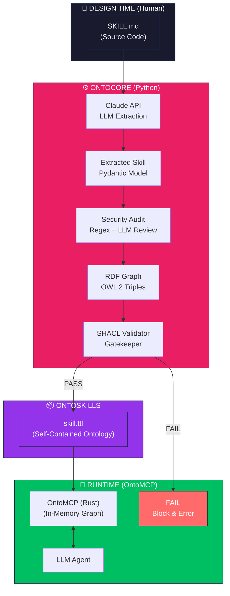
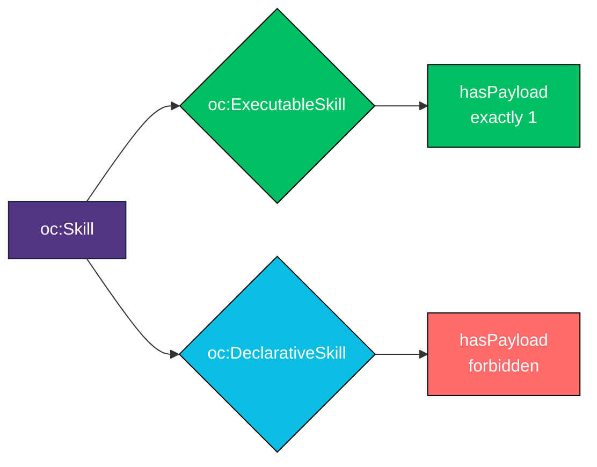
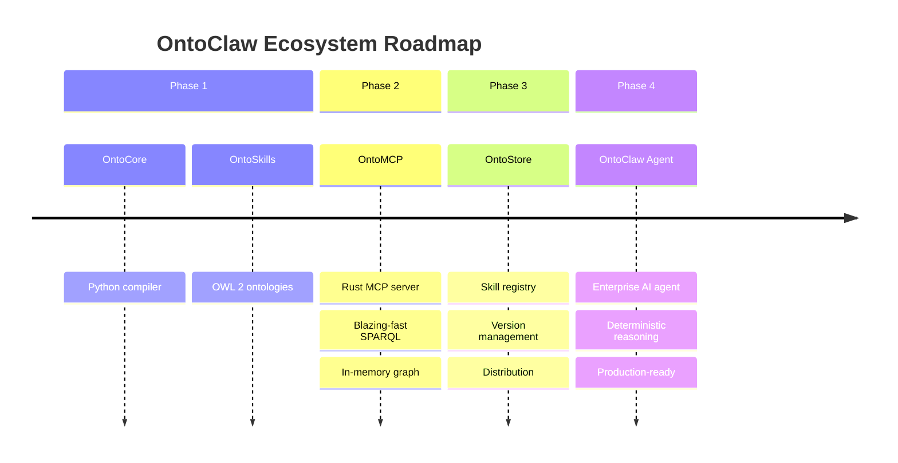
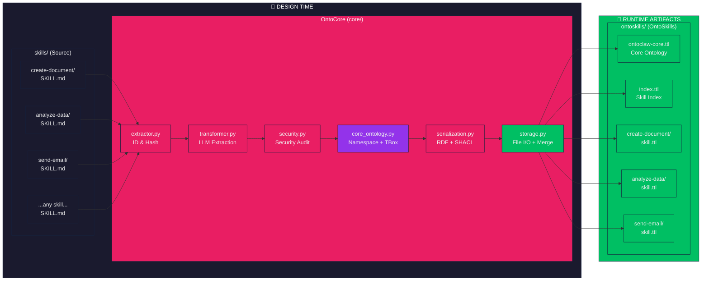
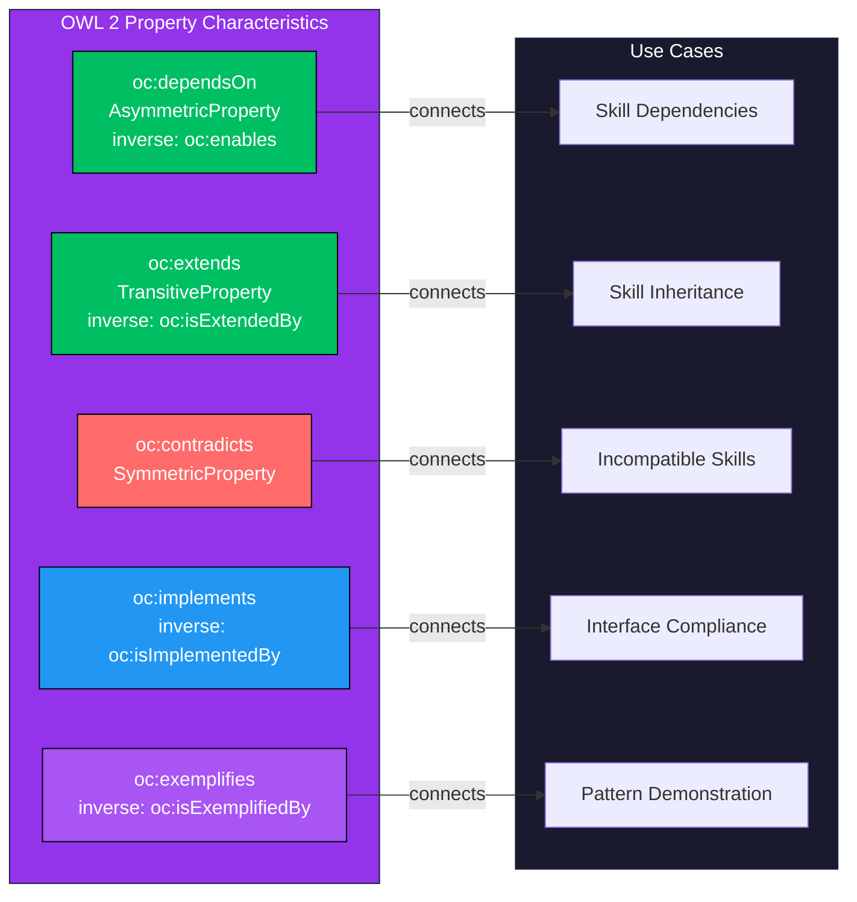
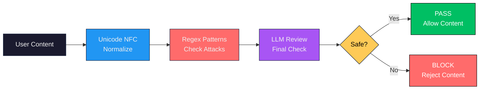

<p align="center">
  
</p>

<h1 align="center">
  <a href="https://ontoclaw.marea.software" style="text-decoration: none; color: inherit; display: flex; align-items: center; justify-content: center; gap: 10px;">
    
    <span>OntoClaw</span>
  </a>
</h1>

<p align="center">
  <strong>The <span style="color:#e91e63">deterministic</span> enterprise AI agent platform.</strong>
</p>

<p align="center">
  Neuro-symbolic architecture for the Agentic Web — <span style="color:#00bf63;font-weight:bold">OntoCore</span> • <span style="color:#2196F3;font-weight:bold">OntoMCP</span> • <span style="color:#9333EA;font-weight:bold">OntoStore</span>
</p>

<p align="center">
  <a href="#the-ontoclaw-ecosystem">Ecosystem</a> •
  <a href="#ontocore--the-compiler">OntoCore</a> •
  <a href="#installation">Installation</a> •
  <a href="#cli-commands">CLI</a> •
  <a href="PHILOSOPHY.md">Philosophy</a>
</p>

<p align="center">
  
  
  
  <a href="#license">
    
  </a>
</p>

---

## The OntoClaw Ecosystem

OntoClaw is a **complete neuro-symbolic platform** for building deterministic, enterprise-grade AI agents. It consists of four layered components:

```
┌─────────────────────────────────────────────────────────────────┐
│                         OntoClaw                                 │
│                    (Enterprise AI Agent)                         │
│                                                                  │
│        Deterministic • Fast • Reliable • Production-Ready        │
│                                                                  │
│     Inspired by OpenClaw, Claude Code, and Cursor — but          │
│     built for enterprise with OWL 2 at its core.                 │
└─────────────────────────────────────────────────────────────────┘
                              │
                              ▼
┌─────────────────────────────────────────────────────────────────┐
│                        OntoStore                                 │
│                    (Skill Registry / Store)                      │
│                                                                  │
│        🚧 Planned — Versioned skill distribution                 │
└─────────────────────────────────────────────────────────────────┘
                              │
                              ▼
┌─────────────────────────────────────────────────────────────────┐
│                        OntoMCP                                   │
│                  (Rust MCP Server — Runtime)                     │
│                                                                  │
│        🚧 Planned — Blazing-fast SPARQL queries via MCP          │
└─────────────────────────────────────────────────────────────────┘
                              │
                              ▼
┌─────────────────────────────────────────────────────────────────┐
│                       OntoSkills                                 │
│               (Compiled OWL 2 Ontologies)                        │
│                                                                  │
│        ✅ Ready — Self-contained, modular, pluggable             │
└─────────────────────────────────────────────────────────────────┘
                              │
                              ▼
┌─────────────────────────────────────────────────────────────────┐
│                        OntoCore                                  │
│              (Python Compiler — Design Time)                     │
│                                                                  │
│        ✅ Ready — SKILL.md → validated OWL 2 TTL                 │
└─────────────────────────────────────────────────────────────────┘
```

---

## OntoCore — The Compiler

**OntoCore** is the first component of the ecosystem. It's a **skill compiler** that transforms natural language skill definitions into **validated semantic knowledge graphs**.

### Design Time vs Runtime

OntoCore separates the skill lifecycle into two distinct phases:

#### Design Time (Human Authored)

```
SKILL.md  ───────►  OntoCore  ───────►  skill.ttl
   │                     │                        │
   ▼                     ▼                        ▼
Human-friendly      LLM extraction +          Self-contained
syntactic sugar     SHACL validation          OWL 2 artifact
```

- **SKILL.md files are source code** — humans write Markdown because writing raw OWL/Turtle is a terrible developer experience
- OntoCore extracts **everything** into the TTL: intents, state transitions, AND the execution payload (actual code/schema to run)
- SKILL.md files are **NOT deployed to production**

#### Runtime (Agent via OntoMCP)

```
┌─────────────────────────────────────────────────────┐
│                                                     │
│    Agent ◄──────► OntoMCP (Rust)                    │
│                        │                            │
│                        ▼                            │
│              In-memory RDF Graph                    │
│              (loads ONLY .ttl files)                │
│                                                     │
│    SKILL.md files DO NOT EXIST in runtime context   │
│                                                     │
└─────────────────────────────────────────────────────┘
```

- **OntoMCP** (the Rust MCP server) loads only compiled `.ttl` files into an in-memory graph
- Skills are **self-contained** — all logic, requirements, and execution payloads live in the ontology
- Ontologies are **modular and pluggable** — add/remove `.ttl` files to change agent capabilities

**The compiled TTL is the executable artifact. The Markdown is just source code that gets compiled away.**

---

## Why OntoClaw?

### The Determinism Problem

LLMs are inherently **non-deterministic** — the same query can yield different results, and reasoning about skill relationships requires reading entire documents. This creates:
- **Context rot** from lengthy skill files
- **Hallucinations** when information is scattered
- **No verifiable structure** for skill relationships

OntoClaw transforms this into **deterministic, queryable knowledge graphs**.

### Description Logics Foundation

Built on **OWL 2** (𝒜𝒞ℛ𝒪ℐ𝒟 Description Logic), enabling:
- **Decidable reasoning** — transitive, symmetric, inverse properties
- **Formal semantics** — no ambiguity in skill relationships
- **SPARQL queries** with O(1) indexed lookup vs O(n) text scanning

### For Smaller Models

When an agent has 50+ skills, reading all SKILL.md files is impractical. With ontologies:
- Query only what's needed: `SELECT ?skill WHERE { ?skill oc:resolvesIntent "create_pdf" }`
- Schema exposure: know what nodes/relations exist before querying
- Smaller models can reason about complex skill ecosystems

[→ Read the full philosophy](PHILOSOPHY.md)

---

### Key Capabilities

| Capability | Description |
|------------|-------------|
| **LLM Extraction** | Uses Claude to extract structured knowledge from SKILL.md files |
| **Knowledge Architecture** | Follows the "A is a B that C" definition pattern (genus + differentia) |
| **OWL 2 Serialization** | Outputs valid OWL 2 ontologies in RDF/Turtle format |
| **SHACL Validation** | Constitutional gatekeeper ensures logical validity before write |
| **State Machines** | Skills can define preconditions, postconditions, and failure handlers |
| **Security Pipeline** | Defense-in-depth: regex patterns + LLM review for malicious content |

### What Gets Compiled

Every skill is extracted with:

- **Identity**: `nature`, `genus`, `differentia` (Knowledge Architecture)
- **Intents**: What user intentions this skill resolves
- **Requirements**: Dependencies (EnvVar, Tool, Hardware, API, Knowledge)
- **Execution Payload**: Optional code to execute (shell, python, node, claude_tool)
- **State Transitions**: `requiresState`, `yieldsState`, `handlesFailure`
- **Provenance**: `generatedBy` attestation (LLM model used)

---

## How It Works



### The Validation Gatekeeper

Every skill must pass SHACL validation before being written to disk. The constitutional shapes in `specs/ontoclaw.shacl.ttl` enforce:

| Constraint | Rule | Error Message |
|------------|------|---------------|
| `resolvesIntent` | Required (min 1) | "Ogni Skill deve avere almeno un resolvesIntent" |
| `generatedBy` | Required (exactly 1) | "Ogni Skill deve avere esattamente un generatedBy" |
| `requiresState` | Must be IRI of `oc:State` | "requiresState deve essere un URI che punta a un'istanza di oc:State" |
| `yieldsState` | Must be IRI of `oc:State` | "yieldsState deve essere un URI..." |
| `handlesFailure` | Must be IRI of `oc:State` | "handlesFailure deve essere un URI..." |

---

## Skill Types



The classification is **automatic** - you don't specify it. If a skill has code to execute, it's executable. If it's knowledge-only, it's declarative.

---

## Components

| Component | Language | Status | Phase | Description |
|-----------|----------|--------|-------|-------------|
| **OntoCore** (`core/`) | Python | ✅ Ready | Design Time | Skill compiler to OWL 2 ontology |
| **OntoMCP** (`mcp/`) | Rust | 🚧 Planned | Runtime | Fast MCP server for ontology queries |
| **OntoStore** | TBD | 📋 Roadmap | Distribution | Versioned skill registry |
| **OntoClaw** | Python/Rust | 📋 Roadmap | Agent | Enterprise AI agent |
| `skills/` | Markdown | ✅ Ready | Design Time | **Source code** — human-authored skill definitions |
| `ontoskills/` | Turtle | Generated | Runtime | **Artifact** — compiled, self-contained ontologies |
| `specs/` | Turtle | ✅ Ready | Both | SHACL shapes constitution |

---

## Roadmap



---

## Installation

```bash
# Clone repository
git clone https://github.com/marea-software/ontoclaw.git
cd ontoclaw

# Install OntoCore
cd core
pip install -e ".[dev]"
```

### Dependencies

| Package | Purpose |
|---------|---------|
| `anthropic>=0.39.0` | Claude API for extraction |
| `click>=8.1.0` | CLI framework |
| `pydantic>=2.0.0` | Data validation |
| `rdflib>=7.0.0` | RDF graph handling |
| `pyshacl>=0.25.0` | SHACL validation |
| `rich>=13.0.0` | Terminal formatting |
| `owlrl>=1.0.0` | OWL reasoning |

---

## CLI Commands

```bash
# Initialize core ontology with predefined states
ontoclaw init-core

# Compile all skills to ontology
ontoclaw compile

# Compile specific skill
ontoclaw compile my-skill

# Query ontology with SPARQL
ontoclaw query "SELECT ?s WHERE { ?s a oc:Skill }"

# List all skills
ontoclaw list-skills

# Run security audit
ontoclaw security-audit
```

### Command Options

| Option | Description |
|--------|-------------|
| `-i, --input` | Input directory (default: `./skills/`) |
| `-o, --output` | Output file (default: `./ontoskills/skills.ttl`) |
| `--dry-run` | Preview without saving |
| `--skip-security` | Skip security checks (not recommended) |
| `-f, --force` | Force recompilation (bypass hash-based cache) |
| `--reason/--no-reason` | Apply OWL reasoning |
| `-y, --yes` | Skip confirmation |
| `-v, --verbose` | Debug logging |
| `-q, --quiet` | Suppress progress |

---

## Exit Codes

| Code | Exception | Description |
|------|-----------|-------------|
| 0 | - | Success |
| 1 | `SkillETLError` | General ETL error |
| 3 | `SecurityError` | Security threat detected |
| 4 | `ExtractionError` | Skill extraction failed |
| 5 | `OntologyLoadError` | Ontology file not found or invalid |
| 6 | `SPARQLError` | Invalid SPARQL query |
| 7 | `SkillNotFoundError` | Skill not found in ontology |
| **8** | `OntologyValidationError` | **SHACL validation failed** |

---

## Project Structure

```
ontoclaw/
├── core/                    # OntoCore — Python skill compiler
│   ├── cli.py               # Click CLI interface
│   ├── config.py            # Configuration constants
│   ├── core_ontology.py     # Namespace and TBox ontology creation
│   ├── exceptions.py        # Exception hierarchy with exit codes
│   ├── extractor.py         # ID and hash generation
│   ├── schemas.py           # Pydantic models
│   ├── security.py          # Defense-in-depth security
│   ├── serialization.py     # RDF serialization with SHACL gatekeeper
│   ├── sparql.py            # SPARQL query engine
│   ├── storage.py           # File I/O, merging, orphan cleanup
│   ├── transformer.py       # LLM tool-use extraction
│   ├── validator.py         # SHACL validation gatekeeper
│   └── tests/               # Test suite (150 tests)
├── mcp/                     # OntoMCP — Rust MCP server (planned)
├── specs/
│   └── ontoclaw.shacl.ttl   # SHACL shapes constitution
├── skills/                  # Input: SKILL.md definitions (source code)
├── ontoskills/              # Output: compiled .ttl files (artifacts)
│   ├── ontoclaw-core.ttl    # Core ontology with states
│   ├── index.ttl            # Index of all skills
│   └── */skill.ttl          # Individual skill modules
└── docs/                    # Documentation
```

---

## Architecture



**Any skill directory works** - just add a `SKILL.md` file and OntoCore will compile it to a validated OWL 2 ontology module.

---

## Testing

```bash
cd core
pytest tests/ -v
```

**Test Coverage**: 150 tests covering:
- Pydantic model validation
- Exception exit codes
- ID/hash generation
- Tool-use loop execution
- Security pattern matching + LLM review
- OWL properties, serialization, merge
- SPARQL query execution
- CLI commands and options
- **SHACL validation (5 comprehensive tests)**

---

## Knowledge Architecture

Skills are extracted following the **Knowledge Architecture** framework:

- **Categories of Being**: Tool, Concept, Work
- **Genus and Differentia**: "A is a B that C" definition structure
- **Relations as First-Class Citizens**:
  - `depends-on` - Skill prerequisites
  - `extends` - Skill inheritance
  - `contradicts` - Incompatible skills
  - `implements` - Interface compliance
  - `exemplifies` - Pattern demonstration

---

## OWL 2 Design



---

## Security Philosophy



Detected threats:
- Prompt injection (`ignore instructions`, `system:`, `you are now`)
- Command injection (`; rm`, `| bash`, command substitution)
- Data exfiltration (`curl -d`, `wget --data`)
- Path traversal (`../`, `/etc/passwd`)
- Credential exposure (`api_key=`, `password=`)

---

## <a id="license"></a>License

<p align="center">
  <a href="LICENSE">
    
  </a>
</p>

OntoClaw is open-source software, licensed under the **[MIT License](LICENSE)**.

| Permissions | Conditions | Limitations |
|-------------|------------|-------------|
| ✅ Commercial use | 📝 Include license and copyright notice | ⚖️ No Liability |
| ✅ Modification | | 🛡️ No Warranty |
| ✅ Distribution | | |
| ✅ Private use | | |

*© 2026 [Marea Software](https://marea.software)*
