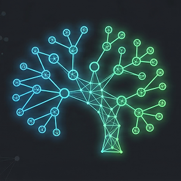
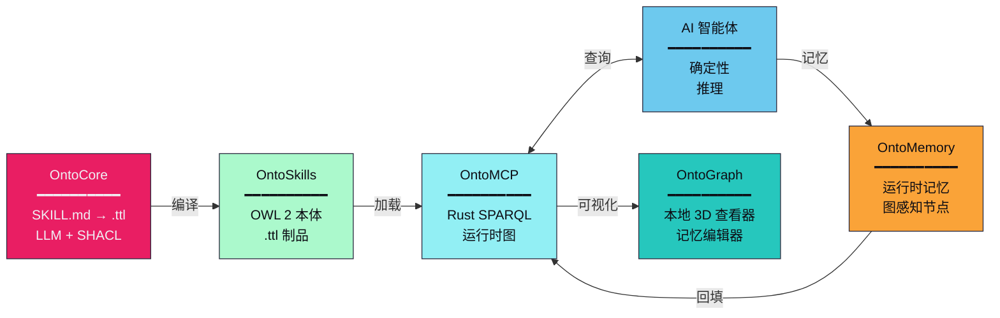

<p align="center">
  
</p>

<h1 align="center">
  <a href="https://ontoskills.sh" style="text-decoration: none; color: inherit; display: flex; align-items: center; justify-content: center; gap: 10px;">
    
    <span>OntoSkills</span>
  </a>
</h1>

<p align="center">
  <a href="README.md">🇬🇧 English</a> • <b>🇨🇳 中文</b>
</p>

<p align="center">
  <strong><span style="color:#e91e63">确定性</span>企业级 AI 智能体平台。</strong>
</p>

<p align="center">
  面向 Agentic Web 的神经符号架构 — <span style="color:#00bf63;font-weight:bold">OntoCore</span> • <span style="color:#2196F3;font-weight:bold">OntoMCP</span> • <span style="color:#9333EA;font-weight:bold">OntoStore</span> • <span style="color:#faa338;font-weight:bold">OntoMemory</span>
</p>

<p align="center">
  <a href="https://ontoskills.sh/zh/docs/overview/">概述</a> •
  <a href="https://ontoskills.sh/zh/docs/getting-started/">快速开始</a> •
  <a href="https://ontoskills.sh/zh/docs/roadmap/">路线图</a> •
  <a href="PHILOSOPHY_zh.md">设计理念</a>
</p>

<p align="center">
  
  
  
  
  <a href="#license">
    
  </a>
</p>

---

## OntoSkills 是什么？

OntoSkills 将自然语言技能定义转换为**经过验证的 OWL 2 本体**——可查询的知识图谱，为 AI 智能体提供确定性推理能力。

**问题：** LLM 以概率方式读取技能。相同的查询，不同的结果。冗长的技能文件消耗大量 token 并使小模型困惑。

**解决方案：** 将技能编译成本体。用 SPARQL 查询。每次都能获得精确答案。



---

## 为什么选择 OntoSkills？

| 问题 | 解决方案 |
|---------|----------|
| LLM 每次对文本的解读都不同 | SPARQL 返回精确答案 |
| 50+ 个技能文件 = 上下文溢出 | 只查询所需内容 |
| 关系没有可验证的结构 | OWL 2 形式语义 |
| 小模型无法理解复杂技能 | 通过图查询实现智能民主化 |

**对于 100 个技能：** ~500KB 文本扫描 → ~1KB 查询

[→ 阅读完整设计理念](PHILOSOPHY_zh.md)

---

## 快速开始

```bash
# 安装 MCP 运行时并引导你的客户端
npx ontoskills install mcp --claude

# 或单独安装 Python 编译器
pip install ontocore
ontocore compile
```

[→ 完整安装指南](https://ontoskills.sh/zh/docs/getting-started/)

---

## 组件

| 组件 | 语言 | 描述 |
|-----------|----------|-------------|
| **OntoCore** | Python | 神经符号编译器：SKILL.md → OWL 2 本体 |
| **OntoMCP** | Rust | MCP 服务器，提供亚毫秒级 SPARQL 查询、运行时记忆 API 和 OntoGraph |
| **OntoStore** | GitHub | 版本化技能注册表 |
| **OntoMemory** | Rust/RDF | 持久化项目/全局记忆，以图感知 `KnowledgeNode` 数据保存 |
| **OntoGraph** | Rust/Web | 本地 3D 查看器和编辑器，用于技能、状态、记忆、意图、主题和关系 |
| **CLI** | Node.js | 一键安装器（`npx ontoskills`） |

---

## 运行时记忆

OntoMemory 将项目和全局知识保存为可编辑的图节点，而不是零散文本备注。记忆是 `oc:Memory` 节点，也是 `oc:KnowledgeNode` 的子类，因此智能体可以通过同一个运行时图检索已编译技能和已保存记忆。

- 记忆可以直接关联技能、意图、主题聚类和其他记忆。
- `depends_on_memory` 表示一个记忆依赖另一个记忆的操作链。
- `supersedes_memory` 记录修正和新版本。
- `related_to_memory` 表示主题相似，但不表示顺序。
- v1 的主题聚类是确定性且本地的；嵌入可用于技能发现，但记忆聚类不依赖嵌入。
- `recluster` 会对已保存记忆进行回填，重新计算主题聚类和通用记忆链接。

OntoGraph 是用于查看运行时图的本地图形 UI。它显示技能、知识节点、状态、记忆、意图和主题，并提供完整的记忆编辑器、入站/出站关系、记忆链和主题聚类高亮。

---

## 文档

- **[概述](https://ontoskills.sh/zh/docs/overview/)** — OntoSkills 是什么及其重要性
- **[快速开始](https://ontoskills.sh/zh/docs/getting-started/)** — 安装和入门
- **[架构](https://ontoskills.sh/zh/docs/architecture/)** — 系统如何工作
- **[OntoMemory](https://ontoskills.sh/zh/docs/ontomemory/)** — 持久化运行时记忆和图关系
- **[知识提取](https://ontoskills.sh/zh/docs/knowledge-extraction/)** — 从技能中提取价值
- **[OntoStore](https://ontoskills.sh/zh/ontostore/)** — 浏览和安装技能
- **[路线图](https://ontoskills.sh/zh/docs/roadmap/)** — 开发阶段

---

## <a id="license"></a>许可证

MIT 许可证 — 详情见 [LICENSE](LICENSE)。

*© 2026 [mareasw/ontoskills](https://github.com/mareasw/ontoskills)*
