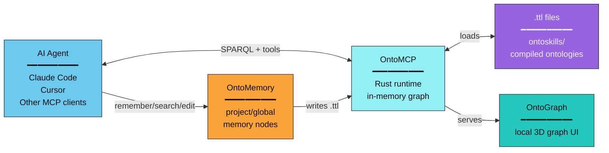
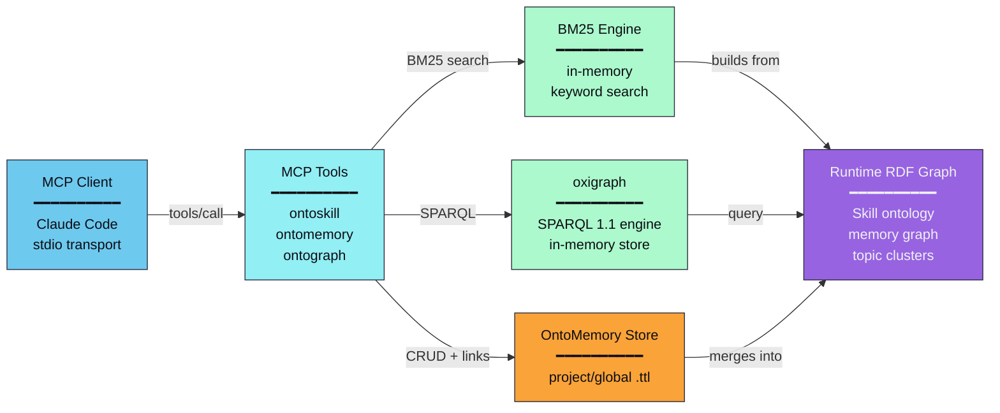
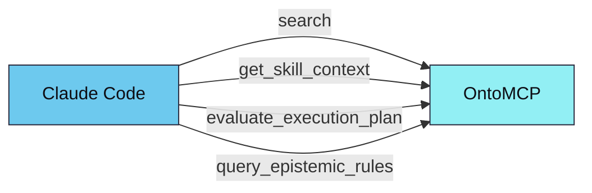

# OntoMCP

Rust-based local MCP (Model Context Protocol) server for the OntoSkills ecosystem.

<p align="right">
  <b>🇬🇧 English</b> • <a href="README_zh.md">🇨🇳 中文</a>
</p>

---

## Overview

OntoMCP is the **runtime layer** of OntoSkills. It loads compiled ontologies (`.ttl` files) and OntoMemory runtime memories into an in-memory RDF graph, then provides blazing-fast SPARQL queries, memory operations, and a local OntoGraph viewer to AI agents via the Model Context Protocol.



**SKILL.md files DO NOT EXIST in the agent's context.** Only compiled `.ttl` artifacts are loaded.

---

## Scope

The MCP server is intentionally focused on:

- **Skill discovery** — Search skills by intent, state, and type
- **Skill context retrieval** — Return execution payload, transitions, dependencies, and all knowledge nodes (epistemic + operational) in one call
- **Planning** — Evaluate whether a skill or intent is executable from the current state set
- **Epistemic retrieval** — Query normalized `KnowledgeNode` rules by kind, dimension, severity, and context
- **Runtime memory** — Store, retrieve, edit, relate, dedupe, and recluster project/global memories as `KnowledgeNode` data in the same RDF graph
- **Graph visualization** — Start OntoGraph, the local 3D viewer/editor for skills, knowledge nodes, states, memories, intents, topics, and relationships

The server does **not** execute skill payloads. Payload execution is delegated to the calling agent in its current runtime context.

---

## Architecture



### Why Rust?

| Benefit | Description |
|---------|-------------|
| **Performance** | Sub-millisecond SPARQL queries for real-time agent interaction |
| **Memory efficiency** | Compact in-memory graph representation |
| **Safety** | Memory-safe by design, critical for production deployments |
| **Concurrency** | Parallel query execution without GIL limitations |

---

## Implemented Tools

| Tool | Purpose |
|------|---------|
| `ontoskill` | Find or load a skill by exact id or natural language query. Query mode can include relevant runtime memories. |
| `ontomemory` | Create, associate, search/list/get, update, link/unlink, archive/delete, and recluster runtime memories. |
| `ontograph` | Start, inspect, or stop the local OntoGraph web UI. |

Compatibility tools such as `search`, `get_skill_context`, `evaluate_execution_plan`, `query_epistemic_rules`, and `prefetch_knowledge` remain callable for clients that already know them, but they are no longer advertised in `tools/list`.

### `ontomemory`

`ontomemory` manages remembered user/project knowledge as graph nodes. Agents may call `remember` with only `content`; by default the server decomposes compound thoughts into atomic memories, auto-associates them with skills, intents, topics, contexts, and nearby memories, deduplicates similar records, and avoids isolated nodes.

| Action | Purpose |
|--------|---------|
| `remember` | Save one or more memories. Defaults: `scope=project`, `auto_associate=true`, `decompose=true`, `dedupe_policy=merge`, `isolation_policy=auto_link`, `auto_link_related=true`. |
| `associate` | Preview the association/decomposition plan without saving. |
| `search` / `list` | Retrieve memories by text, scope, skill, confidence, archive state, or limit. Search uses deterministic local BM25. |
| `get` | Load one memory, optionally including dependency and superseded records with `include_links`, `include_dependencies`, or `include_superseded`. |
| `update` | Replace editable fields and relationship arrays on an existing memory. |
| `link` / `unlink` | Add or remove one explicit graph relation. |
| `forget` | Archive a memory, or permanently remove it with `hard_delete=true`. |
| `recluster` | Recalculate topic clusters and generic memory links for saved memories. Defaults to dry run unless `apply=true`. |

Memory relationship arguments and link relations:

| Relation | Meaning |
|----------|---------|
| `related_to_skill` | The memory applies to a compiled skill. |
| `related_to_intent` | The memory applies to an intent string. |
| `related_to_topic` | The memory belongs to a deterministic topic cluster. Memories may have multiple topics, which creates bridge memories across clusters. |
| `related_to_memory` | The memory is thematically similar to another memory, without implying sequence. |
| `depends_on_memory` | The memory depends on a supporting/prerequisite memory; this forms operational chains. |
| `supersedes_memory` | The memory replaces or corrects an older memory. |

Important behavior:

- **Dedupe**: `dedupe_policy=merge` merges similar memories by default. Use `reject` to fail on duplicates or `allow` to keep them.
- **Anti-isolation**: `isolation_policy=auto_link` attaches new memories to skills, intents, topics, or nearby memories. Use `reject` to fail isolated memories or `inbox` to place them in an unclassified topic.
- **Bridge memories**: memories can carry multiple `related_topic_ids`, so one remembered decision can connect otherwise separate topic clusters.
- **Recluster**: `{"action":"recluster","dry_run":true}` previews changes. `{"action":"recluster","apply":true}` persists recalculated `related_topic_ids` and `related_memory_ids`.
- **Embeddings**: memory clustering v1 is deterministic and local. Embeddings are optional for skill discovery and are not required for `ontomemory`.

Primary RDF predicates:

| RDF predicate | JSON field / relation |
|---------------|-----------------------|
| `oc:memoryId` | `memory_id` |
| `oc:memoryScope` | `scope` |
| `oc:directiveContent` | `content` |
| `oc:relatedToSkill` / `oc:relatedSkillId` | `related_skill_ids`, `related_to_skill` |
| `oc:relatedIntent` | `related_intents`, `related_to_intent` |
| `oc:relatedTopic` | `related_topic_ids`, `related_to_topic` |
| `oc:relatedToMemory` | `related_memory_ids`, `related_to_memory` |
| `oc:dependsOnMemory` | `depends_on_memory_ids`, `depends_on_memory` |
| `oc:supersedesMemory` | `supersedes_memory_ids`, `supersedes_memory` |
| `oc:confidence`, `oc:isArchived`, `oc:createdAt`, `oc:updatedAt` | metadata fields |

Example:

```json
{
  "action": "remember",
  "content": "For this project, release notes depend on the changelog and supersede older draft summaries.",
  "memory_type": "procedure",
  "related_intents": ["write_release_notes"],
  "depends_on_memory_ids": ["mem_changelog_source"],
  "supersedes_memory_ids": ["mem_old_release_summary"]
}
```

---

## Intent Discovery

OntoMCP provides two search engines for skill discovery:

### Default: BM25 Keyword Search

When embeddings are not available, BM25 keyword search is used. It builds an in-memory BM25 index from skill intents, aliases, and nature descriptions at startup.

```json
{
  "name": "search",
  "arguments": {
    "query": "create a pdf document",
    "top_k": 5
  }
}
```

Returns matching skills with BM25 scores:
```json
{
  "mode": "bm25",
  "query": "create a pdf document",
  "results": [
    {
      "skill_id": "pdf",
      "qualified_id": "marea/office/pdf",
      "score": 0.87,
      "matched_by": "keyword",
      "intents": ["create pdf document", "export to pdf"],
      "aliases": ["pdf-generator"],
      "trust_tier": "official"
    }
  ]
}
```

### Semantic Search (ONNX Embeddings) — preferred when available

When compiled with `--features embeddings` and embedding files are present, semantic search is preferred over BM25 — it provides more accurate results for nuanced queries, especially with large skill catalogs.

```bash
# Build with embedding support
cargo build --features embeddings
```

The response includes `"mode": "semantic"` with intent-level matches. If embeddings fail or return no results, BM25 is used as fallback.

### Trust-Tier Scoring

Both BM25 and semantic results use **quality multipliers** based on trust tier:

| Trust Tier | Multiplier | Effect |
|------------|------------|--------|
| `official` | 1.2 | Boosts official author skills (anthropics, coinbase, obra, etc.) |
| `local` | 1.0 | Locally compiled skills (same as verified) |
| `verified` | 1.0 | Neutral (baseline) |
| `community` | 0.8 | Dampens community contributions |

This ensures that an official skill with score 0.80 (hybrid: 0.96) outranks a community skill with score 0.90 (hybrid: 0.72).

### MCP Resource: `ontology://schema`

A compact (~2KB) JSON schema describing available classes, properties, and example queries.

```
1. Agent reads ontology://schema → Knows all properties and conventions
2. User: "I need to create a PDF"
3. Agent calls: search(query: "create a pdf", top_k: 3)
4. Agent queries: SELECT ?skill WHERE { ?skill oc:resolvesIntent "create_pdf" }
5. Agent calls: get_skill_context("pdf")
```

### Performance Targets

| Metric | Target |
|--------|--------|
| Schema resource size | < 4KB |
| search latency (BM25) | < 5ms |
| search latency (semantic, optional) | < 50ms |
| Memory footprint (without embeddings) | < 50MB |

`skill_id` fields accept:
- short ids like `xlsx`
- qualified ids like `marea/office/xlsx`

When a short id is ambiguous, runtime resolution follows:
- `official > local > verified > community`

Responses include package metadata such as:
- `qualified_id`
- `package_id`
- `trust_tier`
- `version`
- `source`

---

## Ontology Source

The server loads compiled `.ttl` files from a directory.

Preferred runtime source:

- `~/.ontoskills/ontologies/system/index.enabled.ttl` — enabled-only manifest generated by the product CLI

Fallbacks:

- `core.ttl` — Core TBox ontology with states
- `index.ttl` — Manifest with `owl:imports`
- `*/ontoskill.ttl` — Individual skill modules

**Auto-discovery**: Looks for `ontoskills/` from current directory upward.

If nothing is found locally, OntoMCP falls back to:

- `~/.ontoskills/ontologies`

**Override**:
```bash
--ontology-root /path/to/ontology-root
# or
ONTOMCP_ONTOLOGY_ROOT=/path/to/ontology-root
# alternative env var (same effect)
ONTOSKILLS_MCP_ONTOLOGY_ROOT=/path/to/ontology-root
```

**ONNX Runtime** (optional, for large skill catalogs):
```bash
ORT_DYLIB_PATH=/path/to/directory-containing-libonnxruntime
```

---

## Run

From repository root:

```bash
cargo run --manifest-path mcp/Cargo.toml
```

With explicit ontology path:

```bash
cargo run --manifest-path mcp/Cargo.toml -- --ontology-root ./ontoskills
```

### OntoGraph Viewer

Start the local 3D knowledge graph UI:

```bash
cargo run --manifest-path mcp/Cargo.toml -- graph --ontology-root ./ontoskills
```

By default the viewer binds to `127.0.0.1:8787` and tries following ports if
the preferred port is busy. The UI shows skills, knowledge nodes, states,
memories, intents, topics, and their relations. Skills are read-only; memories
can be created, edited, archived, hard-deleted, and linked to skills, intents,
topics, and other memories.

OntoGraph highlights memory chains (`depends_on_memory`, `supersedes_memory`),
topic clusters, bridge memories, and incoming/outgoing relationships for the
selected node.

Agents can also call the `ontograph` MCP tool:

```json
{ "action": "start" }
```

It returns the local URL to open in a browser.

---

## One-Command Bootstrap

With the product CLI:

```bash
npx ontoskills install mcp --claude
npx ontoskills install mcp --codex --cursor
npx ontoskills install mcp --cursor --project
```

The CLI installs `ontomcp` first and then configures the selected client globally or for the current project where supported.

## Claude Code Integration

Register the MCP server:

```bash
claude mcp add ontomcp -- \
  ~/.ontoskills/bin/ontomcp
```

After registration, Claude Code can call:



For full setup steps, see the [Claude Code MCP guide](https://ontoskills.sh/docs/claude-code-mcp/).

---

## Testing

```bash
cd mcp
cargo test
```

**Rust test coverage**:
- Skill search
- Skill context retrieval with knowledge nodes
- Guided epistemic rule filtering
- Planner preference for direct skills over setup-heavy alternatives

---

## Related Components

| Component | Language | Description |
|-----------|----------|-------------|
| **OntoCore** | Python | Neuro-symbolic skill compiler |
| **OntoMCP** | Rust | Runtime server (this) |
| **OntoStore** | GitHub | Versioned skill registry |
| **CLI** | Node.js | One-command installer (`npx ontoskills`) |

---

*Part of the [OntoSkills ecosystem](../README.md).*
