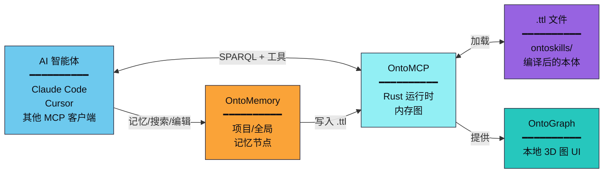
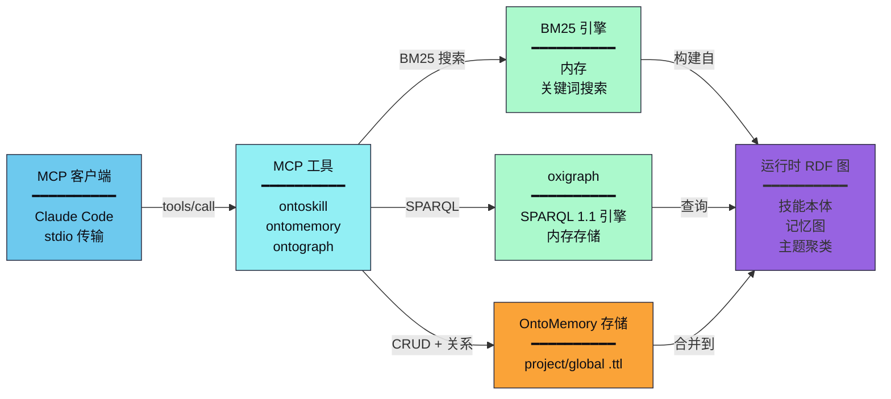
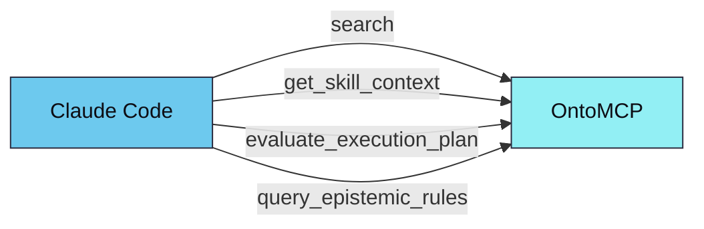

# OntoMCP

OntoSkills 生态系统中基于 Rust 的本地 MCP（模型上下文协议）服务器。

<p align="right">
  <a href="README.md">🇬🇧 English</a> • <b>🇨🇳 中文</b>
</p>

---

## 概述

OntoMCP 是 OntoSkills 的**运行时层**。它将编译后的本体（`.ttl` 文件）和 OntoMemory 运行时记忆加载到内存 RDF 图中，并通过模型上下文协议为 AI 智能体提供极速 SPARQL 查询、记忆操作和本地 OntoGraph 查看器。



**SKILL.md 文件在智能体的上下文中不存在。** 只加载编译后的 `.ttl` 制品。

---

## 范围

MCP 服务器专注于以下功能：

- **技能发现** — 按意图、状态和类型搜索技能
- **技能上下文检索** — 一次调用返回执行负载、状态转换、依赖以及所有知识节点（认知 + 操作）
- **规划** — 评估技能或意图在当前状态集下是否可执行
- **认知检索** — 按类型、维度、严重性和上下文查询规范化的 `KnowledgeNode` 规则
- **运行时记忆** — 将项目/全局记忆作为同一 RDF 图中的 `KnowledgeNode` 数据来保存、检索、编辑、关联、去重和重新聚类
- **图可视化** — 启动 OntoGraph，本地 3D 查看器/编辑器，用于技能、知识节点、状态、记忆、意图、主题和关系

服务器**不**执行技能负载。负载执行委托给调用智能体在其当前运行时环境中完成。

---

## 架构



### 为什么用 Rust？

| 优势 | 描述 |
|------|------|
| **性能** | 亚毫秒级 SPARQL 查询，适合实时智能体交互 |
| **内存效率** | 紧凑的内存图表示 |
| **安全性** | 内存安全设计，适合生产部署 |
| **并发** | 无 GIL 限制的并行查询执行 |

---

## 已实现的工具

| 工具 | 用途 |
|------|------|
| `ontoskill` | 按精确 ID 或自然语言查询查找或加载技能。查询模式可以包含相关运行时记忆。 |
| `ontomemory` | 创建、关联、搜索/list/get、更新、link/unlink、归档/删除和 `recluster` 运行时记忆。 |
| `ontograph` | 启动、检查或停止本地 OntoGraph Web UI。 |

兼容工具 `search`、`get_skill_context`、`evaluate_execution_plan`、`query_epistemic_rules` 和 `prefetch_knowledge` 仍可供已经知道它们的客户端调用，但不会再通过 `tools/list` 广告。

### `ontomemory`

`ontomemory` 将用户/项目知识作为图节点管理。智能体可以只用 `content` 调用 `remember`；默认情况下，服务器会把复合想法拆成原子记忆，自动关联技能、意图、主题、上下文和邻近记忆，合并重复记录，并避免孤立节点。

| 动作 | 用途 |
|------|------|
| `remember` | 保存一个或多个记忆。默认：`scope=project`、`auto_associate=true`、`decompose=true`、`dedupe_policy=merge`、`isolation_policy=auto_link`、`auto_link_related=true`。 |
| `associate` | 预览关联/拆分计划，不写入。 |
| `search` / `list` | 按文本、范围、技能、置信度、归档状态或数量限制检索记忆。搜索使用确定性的本地 BM25。 |
| `get` | 读取一个记忆，可通过 `include_links`、`include_dependencies` 或 `include_superseded` 包含依赖和被替代记录。 |
| `update` | 替换现有记忆的可编辑字段和关系数组。 |
| `link` / `unlink` | 添加或删除一条显式图关系。 |
| `forget` | 归档记忆，或用 `hard_delete=true` 永久删除。 |
| `recluster` | 重新计算已保存记忆的主题聚类和通用记忆链接。除非 `apply=true`，否则默认 dry run。 |

记忆关系参数和 link 关系：

| 关系 | 含义 |
|------|------|
| `related_to_skill` | 记忆适用于某个已编译技能。 |
| `related_to_intent` | 记忆适用于某个意图字符串。 |
| `related_to_topic` | 记忆属于确定性的主题聚类。一个记忆可以有多个主题，从而成为跨聚类的桥接记忆。 |
| `related_to_memory` | 记忆与另一条记忆主题相似，但不表示顺序。 |
| `depends_on_memory` | 记忆依赖一条支撑/前置记忆，用于形成操作链。 |
| `supersedes_memory` | 记忆替代或修正旧记忆。 |

重要行为：

- **去重**：`dedupe_policy=merge` 默认合并相似记忆。使用 `reject` 在重复时失败，或使用 `allow` 保留重复项。
- **防孤立**：`isolation_policy=auto_link` 会把新记忆连接到技能、意图、主题或邻近记忆。使用 `reject` 拒绝孤立记忆，或用 `inbox` 放入未分类主题。
- **桥接记忆**：记忆可以携带多个 `related_topic_ids`，因此一条决策记忆可以连接不同主题聚类。
- **Recluster**：`{"action":"recluster","dry_run":true}` 预览变化。`{"action":"recluster","apply":true}` 持久化重新计算后的 `related_topic_ids` 和 `related_memory_ids`。
- **嵌入**：v1 的记忆聚类是确定性且本地的。嵌入可用于技能发现，但 `ontomemory` 不依赖嵌入。

主要 RDF 谓词：

| RDF 谓词 | JSON 字段 / 关系 |
|----------|------------------|
| `oc:memoryId` | `memory_id` |
| `oc:memoryScope` | `scope` |
| `oc:directiveContent` | `content` |
| `oc:relatedToSkill` / `oc:relatedSkillId` | `related_skill_ids`、`related_to_skill` |
| `oc:relatedIntent` | `related_intents`、`related_to_intent` |
| `oc:relatedTopic` | `related_topic_ids`、`related_to_topic` |
| `oc:relatedToMemory` | `related_memory_ids`、`related_to_memory` |
| `oc:dependsOnMemory` | `depends_on_memory_ids`、`depends_on_memory` |
| `oc:supersedesMemory` | `supersedes_memory_ids`、`supersedes_memory` |
| `oc:confidence`、`oc:isArchived`、`oc:createdAt`、`oc:updatedAt` | 元数据字段 |

---

## 意图发现

OntoMCP 提供两种搜索引擎用于技能发现：

### 默认：BM25 关键词搜索

当嵌入不可用时，使用 BM25 关键词搜索。启动时从技能意图、别名和描述构建内存 BM25 索引。

```json
{
  "name": "search",
  "arguments": {
    "query": "创建 PDF 文档",
    "top_k": 5
  }
}
```

返回匹配的技能及 BM25 分数：
```json
{
  "mode": "bm25",
  "query": "创建 PDF 文档",
  "results": [
    {
      "skill_id": "pdf",
      "qualified_id": "marea/office/pdf",
      "score": 0.87,
      "matched_by": "keyword",
      "intents": ["create pdf document", "export to pdf"],
      "aliases": ["pdf-generator"],
      "trust_tier": "official"
    }
  ]
}
```

### 语义搜索（ONNX 嵌入）— 可用时优先使用

使用 `--features embeddings` 编译且嵌入文件存在时，语义搜索优先于 BM25 — 对于大量技能目录中的细微查询，语义搜索提供更准确的结果。

```bash
# 构建时启用嵌入支持
cargo build --features embeddings
```

响应包含 `"mode": "semantic"` 及意图级别的匹配结果。如果嵌入失败或无结果，则回退到 BM25。

### MCP 资源：`ontology://schema`

一个紧凑的（约 2KB）JSON 模式，描述可用的类、属性和示例查询。

```
1. 智能体读取 ontology://schema → 了解所有属性和约定
2. 用户："我需要创建一个 PDF"
3. 智能体调用：search(query: "创建 PDF", top_k: 3)
4. 智能体查询：SELECT ?skill WHERE { ?skill oc:resolvesIntent "create_pdf" }
5. 智能体调用：get_skill_context("pdf")
```

### 性能目标

| 指标 | 目标 |
|------|------|
| 模式资源大小 | < 4KB |
| search 延迟（BM25） | < 5ms |
| search 延迟（语义，可选） | < 50ms |
| 内存占用（无嵌入） | < 50MB |

`skill_id` 字段接受：
- 短 ID，如 `xlsx`
- 完全限定 ID，如 `marea/office/xlsx`

当短 ID 有歧义时，运行时解析顺序：
- `official > local > verified > community`

响应包含包元数据，如：
- `qualified_id`
- `package_id`
- `trust_tier`
- `version`
- `source`

---

## 本体来源

服务器从目录加载编译后的 `.ttl` 文件。

首选运行时来源：

- `~/.ontoskills/ontologies/system/index.enabled.ttl` — 产品 CLI 生成的仅启用清单

后备来源：

- `core.ttl` — 核心TBox 本体（含状态定义）
- `index.ttl` — 包含 `owl:imports` 的清单
- `*/ontoskill.ttl` — 单独的技能模块

**自动发现**：从当前目录向上查找 `ontoskills/`。

如果本地未找到，OntoMCP 回退到：

- `~/.ontoskills/ontologies`

**覆盖**：
```bash
--ontology-root /path/to/ontology-root
# 或
ONTOMCP_ONTOLOGY_ROOT=/path/to/ontology-root
# 备选环境变量（效果相同）
ONTOSKILLS_MCP_ONTOLOGY_ROOT=/path/to/ontology-root
```

**ONNX Runtime**（可选，用于大规模技能目录）：
```bash
ORT_DYLIB_PATH=/path/to/directory-containing-libonnxruntime
```

---

## 运行

从仓库根目录：

```bash
cargo run --manifest-path mcp/Cargo.toml
```

指定本体路径：

```bash
cargo run --manifest-path mcp/Cargo.toml -- --ontology-root ./ontoskills
```

### OntoGraph 查看器

启动本地 3D 知识图 UI：

```bash
cargo run --manifest-path mcp/Cargo.toml -- graph --ontology-root ./ontoskills
```

默认情况下，查看器绑定到 `127.0.0.1:8787`；如果首选端口被占用，会尝试后续端口。UI 显示技能、知识节点、状态、记忆、意图、主题及其关系。技能只读；记忆可以创建、编辑、归档、硬删除，并可关联技能、意图、主题和其他记忆。

OntoGraph 会高亮记忆链（`depends_on_memory`、`supersedes_memory`）、主题聚类、桥接记忆，以及所选节点的入站/出站关系。

智能体也可以调用 `ontograph` MCP 工具：

```json
{ "action": "start" }
```

它会返回可在浏览器中打开的本地 URL。

---

## 一键引导

使用产品 CLI：

```bash
npx ontoskills install mcp --claude
npx ontoskills install mcp --codex --cursor
npx ontoskills install mcp --cursor --project
```

CLI 先安装 `ontomcp`，然后在全局或当前项目中配置所选客户端。

## Claude Code 集成

注册 MCP 服务器：

```bash
claude mcp add ontomcp -- \
  ~/.ontoskills/bin/ontomcp
```

注册后，Claude Code 可以调用：



完整设置步骤请参阅 [Claude Code MCP 指南](https://ontoskills.sh/zh/docs/claude-code-mcp/)。

---

## 测试

```bash
cd mcp
cargo test
```

**Rust 测试覆盖**：
- 技能搜索
- 含知识节点的技能上下文检索
- 引导式认知规则过滤
- 规划器优先选择直接技能而非设置密集型替代方案

---

## 相关组件

| 组件 | 语言 | 描述 |
|------|------|------|
| **OntoCore** | Python | 神经符号技能编译器 |
| **OntoMCP** | Rust | 运行时服务器（本组件） |
| **OntoStore** | GitHub | 版本化技能注册表 |
| **CLI** | Node.js | 一键安装器（`npx ontoskills`） |

---

*OntoSkills 生态系统的一部分 — [GitHub](https://github.com/mareasw/ontoskills)*
